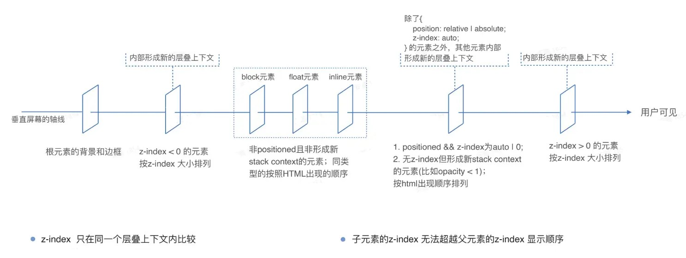

Cascading Style Sheet，层叠样式表: 渲染外观

W3C标准: <https://www.w3.org/Style/CSS/>


## 引入方式

-   **内嵌式**: style标签中, 位置在`<head>`内
    
    当前页面 小案例

    ```html
    <head>
        <meta charset="UTF-8">
        <title>Document</title>
        <style>
            
        </style>
    </head>
    ```

-   **外联式**: 单独.css文件中

    作用多个页面 较大项目
    ```html
    <head>
        
        <link rel="stylesheet" href="style.css">
    </head>
    ```

-   **行内式**: 在标签的属性里
    
    仅一个标签：配合js使用
    ```html
    <div style="color: blue; font-size: 20px;">div content</div>
    ```
    

## 选择器

属性名: 属性值;

```html
<style>
    * { 
        margin: 0;
        padding: 0;
    }
    p {
        color: green;
    }
    .red {
        color: red;
    }
    #one {
        color: blue;
        font: 2em sans-serif;
    }
</style>

    <p>p 标签选择器</p>

    <div class="red">div 类选择器</div>

    <div id="one">div 标签选择器</div>
```


- 标签选择器：`p { }` 选择**所有此类标签**, 无论多少层嵌套
- 类选择器：`.red { }` 类名可重复 多个类名用空格隔开
- id选择器：`#one { }` 唯一对应id，仅选中一个标签
- 属性选择器：`E[att] { }` 具有 att 特性的 E 元素
     - `E[att=val] { }` att 值为 val 的元素
     - `E[att~=val]` , `E[att|="val"]`, `E[att^="val"]`, `E[att$="val"]`, `E[att*="val"]`
- 通配符：`* { }` 选择所有元素
- 后代选择器：`pn child { }` 对于**所有后代** 空格隔开
    - 子代：`pn>son { }` 仅选儿子
- 兄弟选择器：`E~F { }` E 之后的所有 F 兄弟元素
    - 相邻：`E+F { }` E 之后的第一个 F 元素，如果 F 元素不是 E 元素的后一个兄弟元素，则选择不成功。
- 并集：`.red, .two { }` 逗号隔开
- 交集：`p.red { }` 无空格分隔


伪类: `:hover` 鼠标悬浮状态

简写：**emmet语法**


### 优先级

1. 样式表来源
    - 浏览器默认 < 用户样式 < 作者样式（主要的） < 作者样式 `!important` < 浏览器默认 `!important` < 浏览器默认 `!important`
2. 选择器优先级
    - 内联 > id > class = attribute = pseudo-class > type = pseudo-element 
3. 源码位置
    - 最后声明的生效
    - 与 `class="red green"` 引用顺序无关


少用 `id` 与 `!important`


## 盒子模型

- 内容区：内容 + 内边距 + 边框 + 外边距

> 只有 margintop 和 marginbottom 可以为负值，其他的都不能为负值。

```css
/*  三角形  */
.triangle-bottom{
    width: 0;
    height: 0;
    border-left: 50px solid transparent;
    border-right: 50px solid transparent;
    border-bottom: 50px solid red;
}

/*  固定比例矩形  */
.ratio-box{
    /* 新特性写法 */
    /* aspect-ratio: 4 / 3;
    background-color: greenyellow; */
    
    background-color: cadetblue;
    width: 100%;
    height: 0;
    padding: 0;
    /* 是父元素宽度的75% */
    padding-bottom: 75%;
}

/* 渐变边框 */
.awesome-border{
    width: 150px;
    height: 100px;
    border: 8px solid transparent;
    border-radius: 12px;
    background-clip: padding-box,border-box;
    background-origin: padding-box,border-box;
    background-image: linear-gradient(to right,#fff,#fff),linear-gradient(135deg,#e941ab,#a557ef);
}


```


- `box-sizing: border-box;` 宽度计算包含边框宽度
- `box-sizing: content-box;` 宽度计算不包含边框宽度

## 布局

#### 常规流

默认情况下，浏览器会从上到下、从左到右地排列块级元素和行内元素。

相邻的块级元素之间会自动产生垂直间距（margin），这称为“外边距合并（margin collapsing）”。

- 块级元素：独占一行，宽度默认100%，高度默认由内容撑开。
    - 包括 `<div>`、`<h1>`、`<p>`、`<ul>`
    - `display: block;`
    - 环境：BFC（Block Formatting Context）
- 行内元素：水平排列，高度默认由内容撑开
    - 包括 `<span>`、`<a>`、``、`<input>`
    - `display: inline;`
    - 环境：IFC（Inline Formatting Context）


外边距塌陷：两个相邻/嵌套/空的块级元素的外边距相遇时，它们的外边距会合并取其中较大的一个值，而不是叠加。通过添加 `Padding` 或 `Border` 解决，或设置父元素为BFC。

内联格式中 `line-height` 和 height 设置为相同的高度实现对齐


各种内联元素对比：
- `inline`: `<span>` 的默认样式，不接受宽度和高度（由内容决定），不换行。
- `inline-block`: 可以设置宽高（默认由内容撑开），不换行。可以与 inline 元素在同一行排列，控制其上下边距。
- `block`: 有换行，默认宽度100%，高度默认由内容撑开。


行内元素对齐方式：
- `text-align: baseline;`: 基线
- `text-align: middle;`: 居中


#### Flexbox 弹性盒子

一维布局：灵活的响应式设计。

- 容器：`display: flex;`
- 子元素：`display: flex;` 或 `display: inline-flex;`


#### grid 二维网格

基于布局，适合复杂的较大页面。

`display: grid`; 或 `display: inline-grid;`

- 创建网格：`grid-template-columns: 1fr 1fr;`
- 子元素：`grid-column: 1 / 3;`

网格线：
- `grid-column-start`
- `grid-column-end`
- `grid-row-start`
- `grid-row-end`
- `grid-column`
- `grid-row`
- `grid-area`


## 定位

`position` 属性

- `static` 默认值，元素出现在正常的流中。
- `relative` 相对定位，相对于元素本身进行定位。
- `absolute` 绝对定位，相对于最近的已定位祖先元素。
- `fixed` 固定定位，相对于浏览器窗口进行定位， 不受滚动影响。
- `sticky` 粘性定位，相对于最近的已定位祖先元素，当元素进入视口时，固定在顶部或底部。


#### 层叠上下文

staking context：将元素沿着垂直屏幕的虚构的 Z 轴排开。

- 可包含在其他层叠上下文中。
- 独立于兄弟元素，只考虑子元素。
- 子元素的z-index无法超越父元素的z-index显示顺序。

[渲染过程](https://developer.mozilla.org/en-US/docs/Web/CSS/CSS_flow_layout/Introduction_to_formatting_contexts)


形成条件：
- 文档根元素 `<html>`。
- `position: relative;` 或 `position: absolute;` 的元素, z-index 值不为默认值。
- `position: fixed;`, `position: sticky;` 的元素。
- `flex`, `grid`
- `opacity` 值小于 1 的元素。
- 具有 `transform`, `filter`, `backdrop-filter`, `perspective`, `clip-path`, `mask`, `isolation` 属性的元素。


同一个层叠上下文内，元素间也有顺序:

> 使用 CSS 变量或预处理语言的变量来管理 z-index 的值。将预设间隔设置为 10 或 100，以便后续便于插入。


## 动画

计算布局 -> 绘制 -> 合成

触发 reflow 的情况：
1. 修改 DOM 元素
2. 更改样式
3. 调整浏览器窗口大小

需要 CPU 负责重新计算元素的大小、位置和布局。应该尽量不触发。

**合成层（Composition Layers）**

由GPU处理，将多个图层合成一个独立的图层中：减少绘制次数，提升渲染效率。

使用 transform、opacity 等属性时，变化只需要由GPU重绘合成层中单独的图层，在后台运行。

[关于GPU硬件加速渲染详解](https://www.chromium.org/developers/design-documents/gpu-accelerated-compositing-in-chrome/)


#### transform 变形

2d


3D变形

在线试一试： [codepen.io/yao-mo/pen/…](https://codepen.io/yao-mo/pen/YzjYLeO)


#### transition 过渡

`property` 过渡属性 + `duration` 过渡时间 + `timing-function` 过渡函数 + `delay` 延迟时间

三种过渡函数：
- `linear` 线性
- 贝塞尔曲线
    - `ease` 缓动 
    - `ease-in-out`
    - `cubic-bezier(n,n,n,n)` 自定义
- `steps(n, start|end)` 分段函数阶跃


#### animation 动画

animation 属性参考：[developer.mozilla.org/zh-CN/docs/…](https://developer.mozilla.org/en-US/docs/Web/CSS/animation)

关键帧

```css
@keyframes 动画名称 {
    from {
        /* 开始状态 */
    }
    to {
        /* 结束状态 */
    }
}
```

- `animation-name`: 关键帧名称
- `animation-duration`: 持续时间
- `animation-timing-function`: 节奏
- `animation-delay`: 延迟开始时间
- `animation-iteration-count`: 重复次数
- `animation-direction`: 反向/交替
- `animation-fill-mode`: 执行前后样式
- `animation-play-state`: 运行状态


## 响应式设计

原则：
- 优先选用流式布局，如百分比、`flex`、 `grid`等
- 使用响应式图片，匹配尺寸，节省带宽
- 使用媒体查询为不同的设备类型做适配
- 给移动端设备设置简单、统一的视口
- 使用相对长度，`em`、`rem`、`vw` 做为长度度量

#### 媒体查询

根据不同的设备特性（如屏幕大小、分辨率、方向等）应用不同的样式。

```css
@media screen and (min-width: 768px) {
    /* 针对屏幕宽度大于768px的设备 */
}

@media screen and (max-width: 767px) {
    /* 针对屏幕宽度小于768px的设备 */
}

@media screen and (min-width: 768px) and (max-width: 1023px) {
    /* 针对屏幕宽度介于768px和1023px之间的设备 */
}

@media screen and (min-width: 1024px) {
    /* 针对屏幕宽度大于1024px的设备 */
}

@media screen and (min-device-width: 768px) and (max-device-width: 1024px) and (orientation: portrait) {
    /* 针对竖屏设备 */
}

@media screen and (min-device-width: 768px) and (max-device-width: 1024px) and (orientation: landscape) {
    /* 针对横屏设备 */
}
```

遵循cascading层叠覆盖原则，尽量将一般样式放在前面，特定样式放在后面。

#### 像素与尺寸设计

确保阅读体验是相对一致

- 视觉尺寸：1px = 1/96英寸
- CSS像素：1px = 0.75pt
- 设备像素比：DPR = 设备像素/CSS像素


移动端设备viewport的适配:

`<meta name="viewport" content="width=device-width, initial-scale=1.0">`


- `em` 表示相对于使用它的元素的字体大小。
- `rem` 为相对于根元素（`<html>`）的字体大小。

```css
/* 1em = 16px */
html {  
    font-size: 16px; /* 根元素字体大小 */  
}  
.element {  
    font-size: 2rem; /* 该元素的字体大小为 32px (16px * 2) */  
}  
.child {  
    font-size: 2rem; /* 该元素的字体大小仍然为 32px */  
}

.paragraph {
    font-size: 12px;
    padding: 1em; /* 1em = 16px */
    border-radius: 0.5em; /* 0.5em = 8px */
    line-height: 1.5em; /* 24px */
}
```

设置rem为视口宽度的10%，等比缩放。

```js
function setRem(ratio) {
    const rem = document.documentElement.clientWidth / ratio;
    document.documentElement.style.fontSize = rem + 'px';
}
```

- `vw` 视窗宽度的百分比，视窗宽度为视口宽度的100%。`vh` 视窗高度的百分比。


## CSS 工程化

语言增强-CSS预处理器

- 自定义变量
- 嵌套选择器、作用域
- 循环、条件语句、定义函数
- mixins、继承


#### CSS 模块化

BEM命名法 `block__element--modifier`：
- Element：模块的组成部分，如header__title、container__item等
- Block：模块的名称，如header、container等
- Modifier：模块的状态或属性，如header--fixed、container--center等

```css
/* 组件 */
.header {
    background-color: #333;
    color: #fff;
}

/* 子组件 */
.header__title {
    font-size: 24px;
}

/* 修饰符 */
.header--fixed {
    position: fixed;
    top: 0;
    left: 0;
    right: 0;
}
```


CSS in JS: 将应用的CSS样式写在JavaScript文件里面，利用js动态生成css。

unique classname

styled component 机制：第二个 classname 作为唯一类名（hash 值），写入 class.

- 首屏渲染、无多余css阻塞


#### 原子化 CSS

- 工具库优先
- 组合使用
- 简单的类名


## 参考资源

AST抽象语法树格式化网址：[astexplorer.net/](https://astexplorer.net/)

