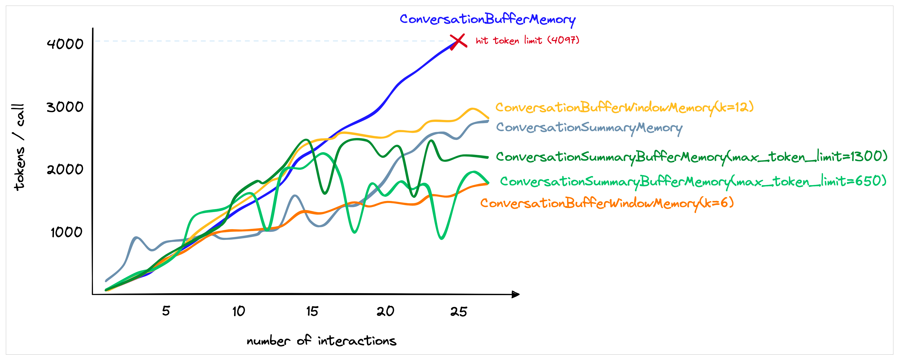

## LangChain功能总结

1. Model I/O 
2. RAG
3. Agent
4. Chain (LCEL)
5. Memory
6. Callbacks

**使用 LCEL**

构造链 LangChain Expression Language 声明式表达方式，轻松组合多个步骤

```py
chain = prompt | model | output_parser
result = chain.invoke({"flower": "玫瑰"})
```

## 简介

本质上就是对各种大模型提供的API的套壳，是为了方便我们使用这些API，搭建起来的一些框架、模块和接口。

> LangChain是一个基于大语言模型（LLMs）用于构建端到端语言模型应用的框架，它可以让开发者使用语言模型来实现各种复杂的任务，例如文本到图像的生成、文档问答、聊天机器人等。LangChain提供了一系列工具、套件和接口，可以简化创建由LLMs和聊天模型提供支持的应用程序的过程。


## Model I/O 过程

输入提示（Format）-> 调用模型（Predict）-> 输出解析（Parse）

1. 提示模板：使用模型的第一个环节是把提示信息输入到模型中，你可以创建LangChain模板，根据实际需求动态选择不同的输入，针对特定的任务和应用调整输入。
2. 语言模型：LangChain允许你通过通用接口来调用语言模型。这意味着无论你要使用的是哪种语言模型，都可以通过同一种方式进行调用，这样就提高了灵活性和便利性。
3. 输出解析：LangChain还提供了从模型输出中提取信息的功能。通过输出解析器，你可以精确地从模型的输出中获取需要的信息，而不需要处理冗余或不相关的数据，更重要的是还可以把大模型给回的非结构化文本，转换成程序可以处理的结构化数据。

LangChain中支持的三大类语言模型:

1. 大语言模型（LLM） ，即Text Model，这些模型将文本字符串作为输入，并返回文本字符串作为输出。
2. 聊天模型（Chat Model），主要代表Open AI的ChatGPT系列模型。这些模型通常由语言模型支持，但它们的 API 更加结构化。具体来说，这些模型将聊天消息列表作为输入，并返回聊天消息。
3. 文本嵌入模型（Embedding Model），这些模型将文本作为输入并返回浮点数列表，也就是Embedding。而文本嵌入模型如OpenAI的text-embedding-ada-002。文本嵌入模型负责把文档存入向量数据库。


LangChain Agent（代理）实例：

```py
# ---- Part 0 导入所需要的类
import os
import requests
from PIL import Image
from transformers import BlipProcessor, BlipForConditionalGeneration
from langchain.tools import BaseTool
from langchain_openai import ChatOpenAI
from langchain.agents import initialize_agent, AgentType

# ---- Part I 初始化图像字幕生成模型
# 指定要使用的工具模型（HuggingFace中的image-caption模型）
hf_model = "Salesforce/blip-image-captioning-large"
print("正在初始化图像字幕生成模型...")

# 初始化处理器和工具模型
# 预处理器将准备图像供模型使用
processor = BlipProcessor.from_pretrained(hf_model)
# 然后我们初始化工具模型本身
model = BlipForConditionalGeneration.from_pretrained(hf_model)
print("初始化图像字幕生成模型成功")


# ---- Part II 定义图像字幕生成工具类
class ImageCapTool(BaseTool):
    name = "Image captioner"
    description = "使用该工具可以生成图片的文字描述，需要传入图片的URL."

    def _run(self, url: str):
        # 下载图像并将其转换为PIL对象
        image = Image.open(requests.get(url, stream=True).raw).convert("RGB")
        # 预处理图像
        inputs = processor(image, return_tensors="pt")
        # 生成字幕
        out = model.generate(**inputs, max_new_tokens=200)
        # 获取字幕
        caption = processor.decode(out[0], skip_special_tokens=True)
        return caption

    def _arun(self, query: str):
        raise NotImplementedError("This tool does not support async")

agent = initialize_agent(
    agent=AgentType.ZERO_SHOT_REACT_DESCRIPTION,
    tools=[ImageCapTool()],
    llm=ChatOpenAI( model=os.environ.get("LLM_MODEL_4K_FUNCTION_CALL"), temperature=0),
    verbose=True,
    handle_parsing_errors=True,
)

img_url = "https://youimg1.c-ctrip.com/target/100v1d000001ej8qh6217.jpg"
agent.run(input=f"{img_url}\n请创作合适的中文推广文案")
```

[API 文档](https://python.langchain.com/docs/get_started)


### 提示工程

好的提示（其实也就是好的问题或指示啦），肯定能够让你在调用语言模型的时候事半功倍。

> GPT 最佳实践: 
> 1. 写清晰的指示
> 2. 给模型提供参考（也就是示例）
> 3. 将复杂任务拆分成子任务
> 4. 给GPT时间思考
> 5. 使用外部工具
> 6. 反复迭代问题


LangChain 提供了多个类和函数，也为各种应用场景设计了很多内置模板，使构建和使用提示变得容易。

> LangChain的优势所在：我们只需要定义一次模板，就可以用它来生成各种不同的提示。
>
> `PromptTemplate` 的 `from_template` 方法就是将一个原始的模板字符串转化为一个更丰富、更方便操作的 `PromptTemplate` 对象，这个对象就是LangChain中的提示模板。
> LangChain中，`SemanticSimilarityExampleSelector` 对象可以根据语义相似性选择最相关的示例， `example_selector` 会根据语义的相似度（余弦相似度）找到最相似的示例

提示框架：指令 + 上下文 + 提示输入 + 输出指示器


GPT-3模型，作为一个大型的自我监督学习模型，通过提升模型规模，实现了出色的**Few-Shot**学习性能。


#### 使用 Chain of Thought

《自我一致性提升了语言模型中的思维链推理能力》：如果生成一系列的中间推理步骤，就能够显著提高大型语言模型进行复杂推理的能力。

> Few-Shot CoT 简单的在提示中提供了一些链式思考示例（Chain-of-Thought Prompting），足够大的语言模型的推理能力就能够被增强。简单说，就是给出一两个示例，然后在示例中写清楚推导的过程。

提供思考示例：问题理解 -> 信息搜索 -> 决策制定 -> 生成结果列表

> Few-Shot CoT，指的就是在带有示例的提示过程中，加入思考的步骤，从而引导模型给出更好的结果。而 Zero-Shot CoT，就是直接告诉模型要一步一步地思考，慢慢地推理。

> CoT 应当被用于 20B 以上参数规模的模型之中，并且模型的训练数据应当于任务问题相关且彼此相互有较强的联结。 首从工程的角度而言，CoT 的适用场景抽象一下可以被归纳为三点，分别是使用大模型（1），任务需要复杂推理（2），参数量的增加无法使得模型性能显著提升（3）。此外，现有的论文实验也表明，CoT 更加适合复杂的推理任务，比如计算或编程，不太适用于简单的单项选择、序列标记等任务之中，并且 CoT 并不适用于那些参数量较小的模型（20B以下），在小模型中使用 CoT 非常有可能会造成机器幻觉等等问题。 而从理论角度，一篇来自斯坦福的论文《Why think step-by-step? reasoning emerges from the locality of experience》揭示了**当大模型的训练数据表现出了变量的局部簇结构（Local Clusters of Variables）**时，CoT 将会展现极好的效果。而变量的局部簇主要指训练数据中变量之间有着强的相互作用，相互影响的关系。

需要深度推理的复杂任务：dfs思维树（Tree of Thoughts，ToT）

> 请你模拟三位出色、逻辑性强的专家合作回答一个问题。每个人都详细地解释他们的思考过程，考虑到其他人之前的解释，并公开承认错误。在每一步，只要可能，每位专家都会在其他人的思考基础上进行完善和建设，并承认他们的贡献。他们继续，直到对问题有一个明确的答案。为了清晰起见，您的整个回应应该是一个Markdown表格。   问题是...

### 调用 OpenAI API

- Text模型：`prompt` 与 `max_tokens` 参数控制生成的文本长度。简洁。
- Chat模型：消息角色：
    - `system`：系统消息主要用于设定对话的背景或上下文。这可以帮助模型理解它在对话中的角色和任务。系统消息通常在对话开始时给出。
    - `user`：用户消息是从用户或人类角色发出的。它们通常包含了用户想要模型回答或完成的请求。
    - `assistant`：助手消息是模型的回复。发送多轮对话中新的对话请求时，可以通过助手消息提供先前对话的上下文。在对话的最后一条消息应始终为用户消息。


响应对象：

```js
{
 'id': 'chatcmpl-2nZI6v1cW9E3Jg4w2Xtoql0M3XHfH',
 'object': 'chat.completion',
 'created': 1677649420,
 'model': 'gpt-4',
 'usage': {'prompt_tokens': 56, 'completion_tokens': 31, 'total_tokens': 87},
 'choices': [
   {
    'message': {
      'role': 'assistant',
      'content': '你的花店可以叫做"花香四溢"。'
     },
    'finish_reason': 'stop',
    'index': 0
   }
  ]
}
```

- `text`：生成的文本。
- `finish_reason`：模型停止生成的原因，可能的值包括 stop（遇到了停止标记）、length（达到了最大长度）或 temperature（根据设定的温度参数决定停止）。
- `created`：生成响应的时间戳。


使用OpenAI API

```py
import os
from openai import OpenAI

# os.environ["OPENAI_API_KEY"] = '你的OpenAI API Key'
# os.environ["OPENAI_BASE_URL"] = 'OpenAI 的 API URL'

client = OpenAI()

# text = client.invoke("请给我写一句情人节红玫瑰的中文宣传语")
response = client.chat.completions.create(
    model=os.environ.get("LLM_MODELEND"),
    messages=[
        {"role": "system", "content": "You are a creative AI."},
        {"role": "user", "content": "请给我的花店起个名"},
    ],
    temperature=0.8,
    max_tokens=600,
)

print(response.choices[0].message.content)
```

通过 LangChain 调用

我们只需要定义一次模板，更简洁。

```py
import os
from langchain_openai import ChatOpenAI
from langchain.schema import HumanMessage, SystemMessage

# os.environ["OPENAI_API_KEY"] = '你的OpenAI API Key'
# os.environ["OPENAI_BASE_URL"] = 'OpenAI 的 API URL'

chat = ChatOpenAI(model=os.environ.get("LLM_MODELEND"), temperature=0.8, max_tokens=600)

messages = [
    SystemMessage(content="你是一个很棒的智能助手"),
    HumanMessage(content="请给我的猫起个名"),
]
response = chat(messages)
print(response)
```


**预训练+微调的大模型应用模式**：高效、扩展性

> 微调（Fine-tuning）：对模型的头部或者部分参数根据自己的需要进行适应性的调整，这通常涉及在相对较小的有标注数据集上进行有监督学习，让模型适应特定任务的需求。
> 微调过程相比于从头训练一个模型要快得多，且需要的数据量也要少得多。

- 预训练：在大规模无标注文本数据上进行模型的训练，学习基本的特征和模式。
- 微调：快速地根据特定任务进行优化，使用标注好的数据集，以便模型能针对特定任务进行优化和调整。

从HuggingFace下载并导入模型使用


### 输出解析

得到清晰的数据结构，方便将解析好的数据存入CSV文档。

输出解析器类要实现两个核心方法：
- `get_format_instructions`：这个方法需要返回一个字符串，用于指导如何格式化语言模型的输出，告诉它应该如何组织并构建它的回答。
- `parse`：这个方法接收一个字符串（也就是语言模型的输出）并将其解析为特定的数据结构或格式。这一步通常用于确保模型的输出符合我们的预期，并且能够以需要的形式进行后续处理。
- `parse_with_prompt`：这个方法接收一个字符串（也就是语言模型的输出）和一个提示（用于生成这个输出的提示），并将其解析为特定的数据结构。这样，你可以根据原始提示来修正或重新解析模型的输出，确保输出的信息更加准确和贴合要求。


> 用 `output_parser.parse(output)` 把模型输出的文案解析成之前定义好的数据格式，也就是一个Python字典，这个字典中包含了 `description` 和 `reason` 这两个字段的值。

**使用 Pydantic（JSON）解析器**: 数据验证、数据转换

```py
import os
# os.environ["OPENAI_API_KEY"] = 'Your OpenAI API Key'

# 创建模型实例
from langchain_openai import ChatOpenAI

model = ChatOpenAI(
    model=os.environ.get("LLM_MODELEND"),
)

# ------Part 2
# 创建一个空的DataFrame用于存储结果
import pandas as pd

df = pd.DataFrame(columns=["flower_type", "price", "description", "reason"])

# 数据准备
flowers = ["玫瑰", "百合", "康乃馨"]
prices = ["50", "30", "20"]

# 定义我们想要接收的数据格式
from pydantic.v1 import BaseModel, Field


class FlowerDescription(BaseModel):
    flower_type: str = Field(description="鲜花的种类")
    price: int = Field(description="鲜花的价格")
    description: str = Field(description="鲜花的描述文案")
    reason: str = Field(description="为什么要这样写这个文案")


# ------Part 3
# 创建输出解析器
from langchain.output_parsers import PydanticOutputParser

output_parser = PydanticOutputParser(pydantic_object=FlowerDescription)

# 获取输出格式指示
format_instructions = output_parser.get_format_instructions()
print("输出格式：", format_instructions)


# ------Part 4
# 创建提示模板
from langchain import PromptTemplate

prompt_template = """您是一位专业的鲜花店文案撰写员。
对于售价为 {price} 元的 {flower} ，您能提供一个吸引人的简短中文描述吗？
{format_instructions}"""

# 根据模板创建提示，同时在提示中加入输出解析器的说明
prompt = PromptTemplate.from_template(
    prompt_template, partial_variables={"format_instructions": format_instructions}
)

# 打印提示
print("提示：", prompt)

# ------Part 5
for flower, price in zip(flowers, prices):
    # 根据提示准备模型的输入
    input = prompt.format(flower=flower, price=price)
    # 打印提示
    print("提示：", input)

    # 获取模型的输出
    output = model.predict(input)
    # 解析模型的输出
    parsed_output = output_parser.parse(output)
    parsed_output_dict = parsed_output.dict()  # 将Pydantic格式转换为字典

    # 将解析后的输出添加到DataFrame中
    df.loc[len(df)] = parsed_output.dict()

# 打印字典
print("输出的数据：", df.to_dict(orient="records"))
```

- 自动修复解析器 `OutputFixingParser`：调用了原有的PydanticOutputParser，如果失败，它会将格式错误的输出以及格式化的指令传递给大模型，并要求LLM进行相关的修复。
- 重试解析器 `RetryWithErrorOutputParser`：利用大模型的推理能力根据原始提示找回相关信息。

文档：LangChain中的各种 [Output Parsers](https://python.langchain.com/docs/how_to/#output-parsers)

## Chain

> LangChain通过设计好的接口，实现一个具体的链的功能。例如，LLM链（LLMChain）能够接受用户输入，使用 PromptTemplate 对其进行格式化，然后将格式化的响应传递给 LLM。这就相当于把整个 Model I/O 的流程封装到链里面；多个链组可以合在一起。

多种类型的预置链：
1. **LLMChain**：这是最简单的链，主要用于处理基本的对话任务、文本生成等。它将输入文本传递给模型并输出结果。
2. **SequentialChain**：将多个链顺序调用。每个链的输出可以作为下一个链的输入。
3. **TransformChain**：对输入进行格式转换、分化
4. **RouterChain**：根据输入的条件，选择不同的链。


`LLMChain` 围绕着语言模型推理功能又添加了一些功能，整合了 `PromptTemplate`、语言模型（LLM或聊天模型）和 `Output Parser`，相当于把Model I/O放在一个链中整体操作。它使用提示模板格式化输入，将格式化的字符串传递给 LLM，并返回 LLM 输出。

```py
# 导入所需的库
from langchain import PromptTemplate, OpenAI, LLMChain
# 原始字符串模板
template = "{flower}的花语是?"
# 创建模型实例
llm = OpenAI(temperature=0)
# 创建LLMChain
llm_chain = LLMChain(
    llm=llm,
    prompt=PromptTemplate.from_template(template))
# 调用LLMChain，返回结果
result = llm_chain("玫瑰")
print(result)
```

路由链：构造提示信息，来引导大模型查看用户输入的问题并确定问题的类型的。

`MultiPromptChain` 类把前几个链整合在一起，实现路由功能。

```py
# 构建多提示链
from langchain.chains.router import MultiPromptChain
chain = MultiPromptChain(
    router_chain=router_chain,
    destination_chains=chain_map,
    default_chain=default_chain,
    verbose=True)

```

### ConversationChain

包含AI前缀与人类前缀的对话摘要格式，这个对话格式和记忆机制结合得非常紧密。

```
# 打印对话的模板
The following is a friendly conversation between a human and an AI. The AI is talkative and provides lots of specific details from its context. If the AI does not know the answer to a question, it truthfully says it does not know. # 减少幻觉

Current conversation:
{history}
Human: {input}
AI:
```

- `{history}` 是存储会话记忆的地方，也就是人类和人工智能之间对话历史的信息。
- `{input}` 是新输入的地方，你可以把它看成是和ChatGPT对话时，文本框中的输入。


加入记忆功能：`conversation = ConversationChain(llm=llm, memory=ConversationBufferMemory())` 。聊天历史信息，都被传入了ConversationChain的提示模板中的 {history} 参数，构建出了包含聊天记录的新的提示输入。

- `ConversationBufferWindowMemory`：缓冲窗口记忆，它的思路就是只保存最新最近的几次人类和AI的互动。因此，它在之前的“缓冲记忆”基础上增加了一个窗口值 `k`。这意味着我们只保留一定数量的过去互动，然后“忘记”之前的互动。
- `ConversationSummaryMemory`：使用LLM将对话历史进行汇总，然后再传递给 {history} 参数。这种方法旨在通过对之前的对话进行汇总来避免长对话过度使用Token。
- `ConversationSummaryBufferMemory`：混合记忆模型，当最新的对话文字长度在300字之内的时候，LangChain会记忆原始对话内容；当对话文字超出了这个参数的长度，那么模型就会把所有超过预设长度的内容进行总结。




## 代理

与外部环境交互，将额外信息合并到推理中。

- 大模型：提供逻辑的引擎，负责生成预测和处理输入。
- 与之交互的外部工具：可能包括数据清洗工具、搜索引擎、应用程序等。
- 控制交互的**代理**：调用适当的外部工具，并管理整个交互过程的流程。


#### ReAct框架

Reasoning-Acting框架：指导大语言模型推理和行动的一种思维框架。

行动 -> 观察 -> 思考 -> 行动

《ReAct：在语言模型中协同推理和行动》：
> 大语言模型可以通过生成推理痕迹和任务特定行动来实现更大的协同作用。
> Reasoning包括了对当前环境和状态的观察，并生成推理轨迹。这使模型能够诱导、跟踪和更新操作计划，甚至处理异常情况。Acting在于指导大模型采取下一步的行动，比如与外部源（如知识库或环境）进行交互并且收集信息，或者给出最终答案。


> 在链中，一系列操作被硬编码（在代码中）。在代理中，LLM被用作推理引擎来确定要采取哪些操作以及按什么顺序执行这些操作。

思考框架：
> Use the following format:\n\n （指导模型使用下面的格式）
> Question: the input question you must answer\n （问题）
> Thought: you should always think about what to do\n （思考）
> Action: the action to take, should be one of [Search, Calculator]\n （行动）
> Action Input: the input to the action\n （行动的输入）
> Observation: the result of the action\n... （观察：行动的返回结果）
> (this Thought/Action/Action Input/Observation can repeat N times)\n （上面这个过程可以重复多次）
> Thought: I now know the final answer\n （思考：现在我知道最终答案了）
> Final Answer: the final answer to the original input question\n\n （最终答案）


根据现有知识解决不了，下一步行动是需要选择工具箱中的搜索工具：
> text: I need to find the current market price of roses and then calculate the new price with a 15% markup.\n （Text：问题文本）
> Action: Search\n （行动：搜索）
> Action Input: "Average price of roses" （行动的输入：搜索玫瑰平均价格）

计算：
> AgentAction(tool='Calculator', tool_input='80.16 * 1.15', log=' I need to calculate the new price with a 15% markup.\nAction: Calculator\nAction Input: 80.16 * 1.15')

最后，AgentExcutor的plan方法返回一个 `AgentFinish` 实例，这表示代理经过对输出的检查，其内部逻辑判断出任务已经完成，思考和行动的循环要结束了。
> Thought: I now know the final answer. 


- **结构化工具对话代理**（Structured Tool Chat）是一种通过预先设定的结构与用户进行交互的工具，可以有效引导对话的主题和内容。
    - 文件管理工具集
    - Web 浏览器工具集
        - `PlayWright` 工具包

- **自主询问搜索代理**（Self-Ask with Search）利用一种叫做 “Follow-up Question（追问）”加“Intermediate Answer（中间答案）”的技巧，来辅助大模型寻找事实性问题的过渡性答案，从而引出最终答案。
    - 逐步逼近，以自己提问并搜索：`使用玫瑰作为国花的国家的首都是哪里? = 使用玫瑰作为国花的国家？ + 都铎王朝的首都在哪里？`

- **计划与执行代理**（Plan and Execute）是指能够根据用户的需求制定计划，并执行相应操作的工具，帮助用户实现特定的目标或任务。
    - 首先，制定一个计划，并将整个任务划分为更小的子任务；然后按照该计划执行子任务。
        - 计划由一个LLM代理（负责推理）完成。
        - 执行由另一个LLM代理（负责调用工具）完成。


#### 使用 arXiv 工具

```py
import os
# 导入库
from langchain_openai import ChatOpenAI
from langchain.agents import load_tools, initialize_agent, AgentType

# 初始化模型和工具
llm = ChatOpenAI(temperature=0.0, model=os.environ.get("LLM_MODELEND"))
tools = load_tools(["arxiv"])

# 初始化链
agent_chain = initialize_agent(tools, llm, agent=AgentType.ZERO_SHOT_REACT_DESCRIPTION, verbose=True)

# 运行链
agent_chain.run("介绍一下2005.14165这篇论文的创新点?")
# Thought: 论文的创新点是在少样本学习设置下测试了 GPT-3 的性能，发现扩大语言模型的规模可以极大地提高任务无关的少样本性能，有时甚至可以与之前最先进的微调方法竞争。
```


[LangChain中集成的所有工具](https://python.langchain.com/docs/integrations/tools/)


## RAG 应用架构

> `Retrieval-Augmented Generation`，即检索增强生成，它结合了检索和生成的能力，为文本序列生成任务引入外部知识。RAG将传统的语言生成模型与大规模的外部知识库相结合，使模型在生成响应或文本时可以动态地从这些知识库中检索相关信息。

数据源 - 大模型应用 - 用例

数据处理管道（Pipeline）
1. Loading：文档加载器把 Documents 加载为以LangChain能够读取的形式。
2. Splitting：文本分割器把 Documents 切分为指定大小的分割，我把它们称为“文档块”或者“文档片”。
3. Storage：将上一步中分割好的“文档块”以“嵌入”（Embedding）的形式存储到向量数据库（Vector DB）中，形成一个个的“嵌入片”。
4. Retrieval：应用程序从存储中检索分割后的文档（例如通过比较余弦相似度，找到与输入问题类似的嵌入片）。
5. Synthesis：把问题和相似的嵌入片传递给语言模型（LLM），使用包含问题和检索到的分割的提示生成答案。


我们使用了 `OpenAIEmbeddings` 来生成嵌入，然后使用 `Qdrant` 这个向量数据库来存储嵌入

词嵌入（Word Embedding）：将文本编码成向量。

> LangChain中的 `Embeddings` 类是设计用于与文本嵌入模型交互的类。这个类为所有这些提供者提供标准接口。

1. `embed_documents` 方法，为文档创建嵌入。接收多个文本作为输入，意味着你可以一次性将多个文档，即被搜索的内容，转换为它们的向量表示。
2. `embed_query` 方法，为查询创建嵌入。只接收一个文本作为输入，通常是用户的搜索查询。


### 存储嵌入

`CacheBackedEmbeddings`：将嵌入缓存在键值存储中。

**通过向量数据库（Vector Store）来保存**

非结构化查询：

通过向量存储检索器 `VectorstoreIndexCreator` 创建索引，在索引的 `query` 方法中，通过 `vectorstore` 类的 `as_retriever` 方法完成检索任务。

```py
# 导入文档加载器模块，并使用 TextLoader 来加载文本文件
from langchain.document_loaders import TextLoader
loader = TextLoader('LangChainSamples/OneFlower/易速鲜花花语大全.txt', encoding='utf8')

# 使用 VectorstoreIndexCreator 来从加载器创建索引
from langchain.indexes import VectorstoreIndexCreator
index = VectorstoreIndexCreator().from_loaders([loader])

# 定义查询字符串, 使用创建的索引执行查询
query = "玫瑰花的花语是什么？"
result = index.query(llm, query)
print(result) # 打印查询结果

from langchain.text_splitter import CharacterTextSplitter
# 进行文本分割
text_splitter = CharacterTextSplitter(chunk_size=1000, chunk_overlap=0)
from langchain_community.vectorstores import Qdrant

# 带有 Qdrant 的向量索引创建器
index_creator = VectorstoreIndexCreator(
    vectorstore_cls=Qdrant,
    embedding,
    text_splitter=CharacterTextSplitter(chunk_size=1000, chunk_overlap=0),
)
```


### 索引

一种高效地管理和定位文档信息的方法，确保每个文档具有唯一标识并便于检索。

> LangChain 利用了记录管理器（RecordManager）来跟踪哪些文档已经被写入向量存储。
>
> 在进行索引时，API 会对每个文档进行哈希处理，确保每个文档都有一个唯一的标识。这个哈希值不仅仅基于文档的内容，还考虑了文档的元数据。确保了即使文档经历了多次转换或处理，也能够精确地跟踪它的状态和来源，确保文档数据被正确管理和索引。


[LangChain中 Indexing 的说明](https://python.langchain.com/docs/how_to/indexing/)

### 性能评估

检索：
- MRR (Mean Reciprocal Rank)：平均倒数排名，是衡量检索结果质量的指标。相关结果首次出现的位置
- Hit rate：检索到的文档中，正确答案的比例。
- NDCG (Normalized Discounted Cumulative Gain)：归一化折扣累积增益，是衡量检索结果质量的指标。

生成：
- BLEU (Bilingual Evaluation Understudy)：双语评估，是衡量生成结果质量的指标。
- ROUGE (Recall-Oriented Understanding Evaluation)：重叠式理解评估，是衡量生成结果质量的指标。
    - Rouge-L: L 表示最大匹配长度，衡量生成结果与参考答案的相似度。
    - Rouge-1: 单词匹配度。
    - Rouge-2: 短语匹配度。

## Agent 框架

让ChatGPT自己生成这些引导文本

#### 模拟代理

**CAMEL 交流式代理**

交流式代理 + 角色扮演 + 启示式提示 `inception prompting`

明确的交互规范，如一次只能给出一个指令，解决方案必须具有详细的解释。使用 “Solution: ” 开始输出解决方案，等等。有助于保持对话的清晰性和高效性。

> CAMEL中提示的设计更加复杂和细致，更像是一种交互协议或规范。这种设计在一定程度上提高了AI与AI之间自主合作的能力，并能更好地模拟人类之间的交互过程。

[CAMEL：用于大规模语言模型社会的“心智”探索的交流式代理](https://arxiv.org/pdf/2303.17760)

#### 自主代理

能够在无需外部干预的情况下自主运行，这在真实世界的应用中具有巨大的价值。

- `Auto-GPT`: 自动链接多个任务。多步提示过程，将目标分解为子任务。
- `BabyAGI`: 自动生成和执行任务，而且还可以根据完成的任务结果生成新任务，并且可以实时确定任务的优先级。
- `HuggingGPT`: 自动生成计划，并处理多个复杂的AI任务。允许HuggingGPT持续接入。


BabyAGI 完成任务过程：

> 向系统提出一个目标之后，它将不断优先考虑需要实现或完成的任务，以实现该目标。具体来说，系统将形成任务列表，从任务列表中拉出优先级最高的第一个任务，使用 OpenAI API 根据上下文将任务发送到执行代理并完成任务，一旦这些任务完成，它们就会被存储在内存（或者Pinecone这类向量数据库）中，然后，根据目标和上一个任务的结果创建新任务并确定优先级。 


HuggingGPT: Solving AI Tasks with ChatGPT and its Friends in Hugging Face

使其能够根据用户请求自动生成计划，并使用外部模型，从而整合多模态感知能力，并处理多个复杂的AI任务。此外，这种流程还允许HuggingGPT持续从任务特定的专家模型中吸收能力，从而实现可增长和可扩展的AI能力。


## 论文

- [开放式表格与文本问题回答](https://arxiv.org/abs/2010.10439v2)，Chen, W., Chang, M.-W., Schlinger, E., Wang, W., & Cohen, W. W. (2021). Open Question Answering over Tables and Text. ICLR 2021.
- Open AI的GPT-3模型：[大模型是少样本学习者](https://proceedings.neurips.cc/paper_files/paper/2020/file/1457c0d6bfcb4967418bfb8ac142f64a-Paper.pdf), Brown, T. B., Mann, B., Ryder, N., Subbiah, M., Kaplan, J., Dhariwal, P., ... & Agarwal, S. (2020). Language models are few-shot learners. arXiv preprint arXiv:2005.14165.
- [微调后的语言模型是零样本学习者](https://arxiv.org/abs/2109.01652), Wei, J., Bosma, M., Zhao, V. Y., Guu, K., Yu, A. W., Lester, B., Du, N., Dai, A. M., & Le, Q. V. (2022). Finetuned Language Models Are Zero-Shot Learners. Proceedings of the International Conference on Learning Representations (ICLR 2022).
- [对示例角色的重新思考：是什么使得上下文学习有效？](https://arxiv.org/abs/2202.12837), Min, S., Lyu, X., Holtzman, A., Artetxe, M., Lewis, M., Hajishirzi, H., & Zettlemoyer, L. (2022). Rethinking the Role of Demonstrations: What Makes In-Context Learning Work? Proceedings of the 2022 Conference on Empirical Methods in Natural Language Processing (EMNLP 2022).
- 2022 年，在 Google 发布的论文 [Chain-of-Thought Prompting Elicits Reasoning in Large Language Models](https://arxiv.org/pdf/2201.11903)中首次提出思维链（Chain of Thought），Wang, X., Wei, J., Schuurmans, D., Le, Q., Chi, E., Narang, S., Chowdhery, A., & Zhou, D. (2023). Self-Consistency Improves Chain of Thought Reasoning in Language Models. Proceedings of the International Conference on Learning Representations (ICLR). arXiv preprint arXiv:2203.11171.
- [论文，思维之树：使用大型语言模型进行深思熟虑的问题解决](https://arxiv.org/pdf/2305.10601)，Yao, S., Yu, D., Zhao, J., Shafran, I., Griffiths, T. L., Cao, Y., & Narasimhan, K. (2023). Tree of Thoughts: Deliberate Problem Solving with Large Language Models. arXiv preprint arXiv:2305.10601.
- [ReAct：在语言模型中协同推理和行动](https://arxiv.org/abs/2210.03629)，Yao, S., Zhao, J., Yu, D., Du, N., Shafran, I., Narasimhan, K., & Cao, Y. (2023). ReAct: Synergizing Reasoning and Acting in Language Models. arXiv preprint arXiv:2210.03629
- [ART：大型语言模型的自动多步推理和工具使用](https://arxiv.org/abs/2303.09014)，Paranjape, B., Lundberg, S., Singh, S., Hajishirzi, H., Zettlemoyer, L., & Ribeiro, M. T. (2023). ART: Automatic multi-step reasoning and tool-use for large language models. arXiv preprint arXiv:2303.09014.
- ["计划与解决"提示：通过大型语言模型改进Zero-Shot链式思考推理](https://arxiv.org/abs/2305.04091) Wang, L., Xu, W., Lan, Y., Hu, Z., Lan, Y., Lee, R. K.-W., & Lim, E.-P. (2023). Plan-and-Solve Prompting: Improving Zero-Shot Chain-of-Thought Reasoning by Large Language Models. arXiv preprint arXiv:2305.04091.
- [Large Language Models are Zero-Shot Reasoners](https://arxiv.org/pdf/2205.11916)
- 论文 [HuggingGPT: Solving AI Tasks with ChatGPT and its Friends in Hugging Face](https://link.juejin.cn/?target=https%3A%2F%2Farxiv.org%2Fpdf%2F2303.17580.pdf "https://arxiv.org/pdf/2303.17580.pdf")


- [Retrieval-Augmented Generation for Large Language Models: A Survey](https://arxiv.org/abs/2312.10997)
- [Query Rewriting for Retrieval-Augmented Large Language Models](https://arxiv.org/pdf/2305.14283)
